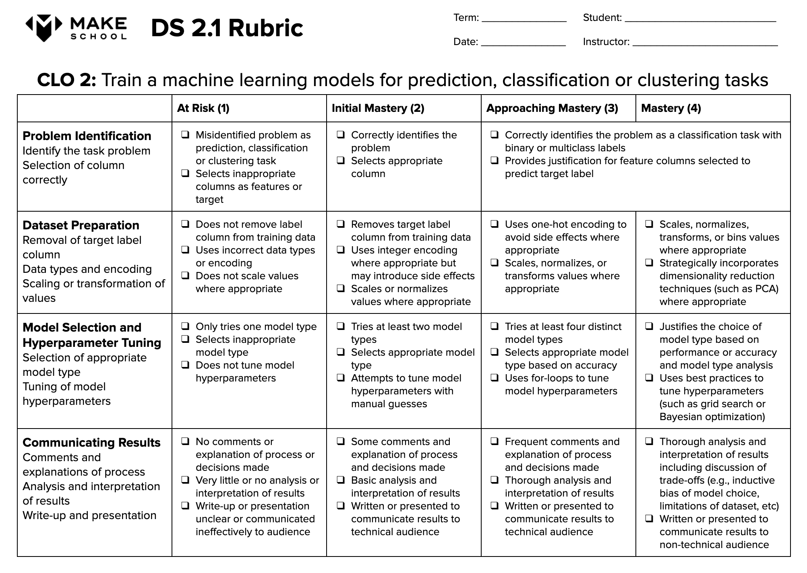

# DS 2.1: Machine Learning Final Project: 2018 Match Analysis - [First Robotics Compition](https://www.firstinspires.org/robotics/frc)

## Project Summary
For your final project in this course, you will choose your own dataset to clean, investigate, and make predictions or classification or clustering with. On the final day of the class day, you will give a brief (4-6 min) presentation about your dataset, methodology, and findings. You may choose to work alone or with one partner on this project. Any dataset you choose should be approved by the instructor before beginning.

## Authors: Chris Barnes & Luke Harrison

## [Project Guidelines](https://docs.google.com/document/d/1Oc7kbLBC_JRURMLmNREqriWr2Xrywzyh7_P7BzHXtWk)

## Where is your data from?
#### [Dataset From Kaggle https://www.kaggle.com/samcfuchs/frc-2018](https://www.kaggle.com/samcfuchs/frc-2018)

## Event Details
[2018 FIRST Robotics Competition - FIRST POWER UP Game PREVIEW](https://www.youtube.com/watch?v=HZbdwYiCY74)

[2018 FRCGame Season Manual](https://firstfrc.blob.core.windows.net/frc2018/Manual/2018FRCGameSeasonManual.pdf)

[PNW District Auburn Event 2018](https://www.thebluealliance.com/event/2018waahs)

[PNW District Auburn Event Insights 2018](https://www.thebluealliance.com/event/2018waahs#event-insights)

[PNW District Auburn Mountainview Event 2018](https://www.thebluealliance.com/event/2018waamv)

[PNW District Auburn Mountainview Event Insights 2018](https://www.thebluealliance.com/event/2018waamv#event-insights)

[Team 2927: πRho Techs](https://www.thebluealliance.com/team/2927/2018)

## What were you looking to answer and predictions you wanted to make?
1. Points Analysis
    - How were points distributed?
2. Obsticle Analysis
    - What obsticles where used most often?
    - What obsticle(s) affected win/lose ratio the most?
3. Team Analysis
    - What alliances (group of 3 teams) won/lost most often?
    - What team won/lost most often?
    - What team won/lost least often?
4. Location Analysis
    - Does region or origin affect win/lose ratio?
    - Does playing location affect win/lose ratio?
5. Other Analysis

## A brief summary of our methodology for answering these questions
Using Clustering, Classification, and Regression analysis methods we plan to simplify and deduce the order and magnitude in which something affects the outcome of another.

Using Fitted and Embedded Methods to do analysis

√ 1- Apply supervised or un-supervised models to a dataset (or problem) you are interested in. Investigate variety of steps
to make the model better including:
  - Hyper-parameter tuning by Grid-search
  - Check if dataset is balanced or not -> change the threshold
  - Data preprocessing (scaling)
  - Dimensionality reduction (PCA) -> train the model based on X_reduced_train and Y_reduced_train
  - Eliminate unnecessary features -> Feature Engineering
  - Try other models and do the above all steps

√ 2- Read blogs about Feature Engineering and make your model performance better with variety of Feature Engineering options:
- https://towardsdatascience.com/feature-selection-correlation-and-p-value-da8921bfb3cf
- https://towardsdatascience.com/feature-selection-with-pandas-e3690ad8504b

3- Build a Decision Tree (DT) classifier from Scratch (you can use Pandas or any other Python built-in functions) and provide DT visualization. For any categorical dataset, your function should return the optimal tree with the root and all appropriate leafs, max_depth of the tree and the visualized graph. You can follow the steps we explored in class but should work for any dataset for example if we pass Lens dataset. 

## Project Rubric
